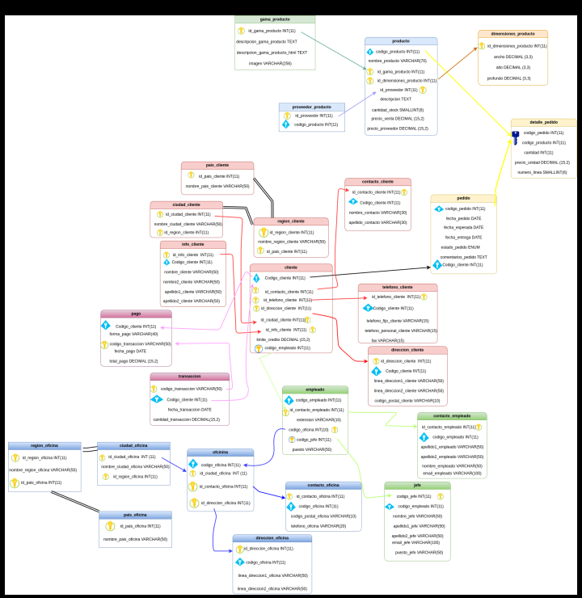

# Consultas sobre una tabla

1. Devuelve un listado con el código de oficina y la ciudad donde hay oficinas.

SELECT o.codigo_oficina, c_o.nombre_ciudad_oficina
FROM oficina AS o
INNER JOIN ciudad_oficina AS c_o ON o.id_ciudad_oficina = c_o.id_ciudad_oficina;
+----------------+-----------------------+
| codigo_oficina | nombre_ciudad_oficina |
+----------------+-----------------------+
|              1 | Ciudad de México      |
|              2 | Guadalajara           |
|              3 | Monterrey             |
|              4 | Puebla                |
|              5 | Querétaro             |
|              6 | Tijuana               |
|              7 | León                  |
|              8 | Cancún                |
|              9 | Mérida                |
|             10 | Chihuahua             |
+----------------+-----------------------+

2. Devuelve un listado con la ciudad y el teléfono de las oficinas de España.

SELECT ciu_o.nombre_ciudad_oficina,con_o.telefono_oficina
FROM ciudad_oficina AS ciu_o
INNER JOIN contacto_oficina AS con_o ON ciu_o.codigo_oficina = con_o.codigo_oficina 
INNER JOIN pais_oficina AS pai_o ON ciu_o.codigo_oficina = pai_o.codigo_oficina
WHERE pai_o.nombre_pais_oficina = 'España';
  +-----------------------+------------------+
| nombre_ciudad_oficina | telefono_oficina |
+-----------------------+------------------+
| Puebla                | 555-456-789      |
+-----------------------+------------------+
  
3. Devuelve un listado con el nombre, apellidos y email de los empleados cuyo
  jefe tiene un código de jefe igual a 7.

  SELECT con_e.nombre_empleado,con_e.apellido1_empleado,con_e.apellido2_empleado, con_e.email_empleado
FROM contacto_empleado AS con_e
INNER JOIN jefe AS j ON con_e.codigo_empleado = j.codigo_empleado
WHERE j.codigo_jefe = 7;

  +-----------------+--------------------+--------------------+------------------+
| nombre_empleado | apellido1_empleado | apellido2_empleado | email_empleado   |
+-----------------+--------------------+--------------------+------------------+
| Luis Fernando   | Gómez              | Vázquez            | luis@example.com |
+-----------------+--------------------+--------------------+------------------+
  
4. Devuelve el nombre del puesto, nombre, apellidos y email del jefe de la
  empresa.

  SELECT j.puesto_jefe,j.nombre_jefe,j.apellido1_jefe,j.apellido2_jefe,j.email_jefe
  FROM jefe AS j;
+-----------------------------+-------------+----------------+----------------+-----------------------+
| puesto_jefe                 | nombre_jefe | apellido1_jefe | apellido2_jefe | email_jefe            |
+-----------------------------+-------------+----------------+----------------+-----------------------+
| Director General            | Gerardo     | Hernández      | Gómez          | gerardo@example.com   |
| Gerente de Área             | Roberto     | Fernández      | Sánchez        | roberto@example.com   |
| Gerente de Ventas           | Eduardo     | López          | Martínez       | eduardo@example.com   |
| Gerente de Marketing        | Alejandro   | Pérez          | Gómez          | alejandro@example.com |
| Gerente de Finanzas         | María       | González       | López          | maria@example.com     |
| Gerente de Recursos Humanos | Laura       | Martínez       | Sánchez        | laura@example.com     |
| Gerente de Producción       | Pedro       | Gómez          | García         | pedro@example.com     |
| Gerente de Logística        | Carlos      | López          | Pérez          | carlos@example.com    |
| Gerente de Calidad          | Ana         | Sánchez        | Gómez          | ana@example.com       |
| Gerente de Tecnología       | Sergio      | García         | Martínez       | sergio@example.com    |
+-----------------------------+-------------+----------------+----------------+-----------------------+
  
5. Devuelve un listado con el nombre, apellidos y puesto de aquellos
  empleados que no sean representantes de ventas.

  SELECT con_e.nombre_empleado,con_e.apellido1_empleado,con_e.apellido2_empleado,e.puesto
FROM empleado AS e
INNER JOIN contacto_empleado AS con_e ON e.codigo_empleado = con_e.codigo_empleado
WHERE NOT e.puesto = 'Representante de ventas';

+-----------------+--------------------+--------------------+---------------+
| nombre_empleado | apellido1_empleado | apellido2_empleado | puesto        |
+-----------------+--------------------+--------------------+---------------+
| Juan            | Hernández          | Gómez              | Gerente       |
| María Elena     | Sánchez            | Martínez           | Analista      |
| Pedro Luis      | González           | Ramírez            | Asistente     |
| Ana Sofía       | Pérez              | Díaz               | Supervisor    |
| Sara Alejandra  | García             | Torres             | Asistente     |
| Pablo Javier    | López              | Fernández          | Administrador |
| Luis Fernando   | Gómez              | Vázquez            | Asistente     |
| Jorge Emilio    | Gutiérrez          | Hernández          | Desarrollador |
| Rosa María      | Martínez           | Gómez              | Asistente     |
+-----------------+--------------------+--------------------+---------------+

6. Devuelve un listado con el nombre de los todos los clientes españoles.

SELECT inf_c.nombre_cliente
FROM info_cliente AS inf_c
INNER JOIN pais_cliente AS pai_e ON inf_c.codigo_cliente = pai_e.codigo_cliente
WHERE pai_e.nombre_pais_cliente = 'España';
+----------------+
| nombre_cliente |
+----------------+
| Ana            |
| Carla          |
+----------------+

7. Devuelve un listado con los distintos estados por los que puede pasar un
  pedido.
SELECT DISTINCT p.estado_pedido
FROM pedido AS p;
+---------------+
| estado_pedido |
+---------------+
| finalizado    |
| en proceso    |
| no permitido  |
+---------------+
  
8. Devuelve un listado con el código de cliente de aquellos clientes que
  realizaron algún pago en 2008. Tenga en cuenta que deberá eliminar
  aquellos códigos de cliente que aparezcan repetidos. Resuelva la consulta:
  • Utilizando la función YEAR de MySQL.
  • Utilizando la función DATE_FORMAT de MySQL.
  • Sin utilizar ninguna de las funciones anteriores.

**YEAR**
SELECT c.codigo_cliente
FROM cliente AS c
INNER JOIN pago AS pa ON pa.codigo_cliente = c.codigo_cliente
WHERE YEAR(pa.fecha_pago) = '2008';
+----------------+
| codigo_cliente |
+----------------+
|              1 |
|              9 |
+----------------+

**DATE_FORMAT**
SELECT c.codigo_cliente
FROM cliente AS c
INNER JOIN pago AS pa ON pa.codigo_cliente = c.codigo_cliente
WHERE DATE_FORMAT(pa.fecha_pago, '%Y')= '2008';

**SIN FUNCIONES**
SELECT c.codigo_cliente
FROM cliente AS c
INNER JOIN pago AS pa ON pa.codigo_cliente = c.codigo_cliente
WHERE pa.fecha_pago LIKE '2008-%';

9. Devuelve un listado con el código de pedido, código de cliente, fecha
  esperada y fecha de entrega de los pedidos que no han sido entregados a
  tiempo.
  SELECT pe.codigo_pedido,pe.codigo_cliente,pe.fecha_esperada,pe.fecha_entrega
FROM pedido AS pe
WHERE NOT pe.fecha_esperada = pe.fecha_entrega;

+---------------+----------------+----------------+---------------+
| codigo_pedido | codigo_cliente | fecha_esperada | fecha_entrega |
+---------------+----------------+----------------+---------------+
|             1 |              1 | 2024-04-10     | 2024-04-11    |
|             2 |              2 | 2024-04-11     | 2024-04-12    |
|             3 |              3 | 2024-04-12     | 2024-04-13    |
+---------------+----------------+----------------+---------------+

11. Devuelve un listado con el código de pedido, código de cliente, fecha
    esperada y fecha de entrega de los pedidos cuya fecha de entrega ha sido al
    menos dos días antes de la fecha esperada.
    • Utilizando la función ADDDATE de MySQL.
    • Utilizando la función DATEDIFF de MySQL.
    • ¿Sería posible resolver esta consulta utilizando el operador de suma + o
    resta -?

  **ADDDATE**
  SELECT pe.codigo_pedido, pe.codigo_cliente, pe.fecha_esperada, pe.fecha_entrega
FROM pedido AS pe
WHERE pe.fecha_entrega <= ADDDATE(pe.fecha_esperada, -2);

+---------------+----------------+----------------+---------------+
| codigo_pedido | codigo_cliente | fecha_esperada | fecha_entrega |
+---------------+----------------+----------------+---------------+
|             5 |              5 | 2024-04-14     | 2024-04-12    |
+---------------+----------------+----------------+---------------+

**DATEDIFF**
SELECT pe.codigo_pedido, pe.codigo_cliente, pe.fecha_esperada, pe.fecha_entrega
FROM pedido AS pe
WHERE DATEDIFF(pe.fecha_esperada, pe.fecha_entrega) >= 2;

**SIN FUNCIONES**
SELECT pe.codigo_pedido, pe.codigo_cliente, pe.fecha_esperada, pe.fecha_entrega
FROM pedido AS pe
WHERE pe.fecha_entrega BETWEEN pe.fecha_esperada - INTERVAL 2 DAY AND pe.fecha_esperada;

12. Devuelve un listado de todos los pedidos que fueron rechazados en 2009.

  SELECT pe.codigo_pedido, pe.codigo_cliente,pe.estado_pedido
FROM pedido AS pe
WHERE pe.estado_pedido = 'no permitido' AND YEAR(pe.fecha_pedido)='2009';

 +---------------+----------------+---------------+
| codigo_pedido | codigo_cliente | estado_pedido |
+---------------+----------------+---------------+
|             5 |              5 | no permitido  |
|             9 |              9 | no permitido  |
+---------------+----------------+---------------+

13. Devuelve un listado de todos los pedidos que han sido entregados en el
    mes de enero de cualquier año.
  SELECT pe.codigo_pedido, pe.fecha_entrega
FROM pedido AS pe
WHERE MONTH(pe.fecha_entrega)='01';

+---------------+---------------+
| codigo_pedido | fecha_entrega |
+---------------+---------------+
|            10 | 2010-01-02    |
+---------------+---------------+

14. Devuelve un listado con todos los pagos que se realizaron en el
    año 2008 mediante Paypal. Ordene el resultado de mayor a menor.

  SELECT pa.codigo_pago,pa.total_pago
FROM pago AS pa
WHERE YEAR(pa.fecha_pago)='2008' AND pa.forma_pago ='Paypal';

  +-------------+------------+
| codigo_pago | total_pago |
+-------------+------------+
|           5 |     220.00 |
|           7 |     190.00 |
+-------------+------------+

15. Devuelve un listado con todas las formas de pago que aparecen en la
    tabla pago. Tenga en cuenta que no deben aparecer formas de pago
    repetidas.
    
  SELECT DISTINCT pa.forma_pago
FROM pago AS pa;

  +------------------------+
| forma_pago             |
+------------------------+
| Tarjeta de crédito     |
| Transferencia bancaria |
| Efectivo               |
| Cheque                 |
| PayPal                 |
| Tarjeta de débito      |
+------------------------+
17. Devuelve un listado con todos los productos que pertenecen a la
    gama Ornamentales y que tienen más de 100 unidades en stock. El listado
    deberá estar ordenado por su precio de venta, mostrando en primer lugar
    los de mayor precio.

  SELECT g_pr.descripcion_gama_producto,pr.precio_venta,pr.cantidad_stock
FROM producto AS pr
INNER JOIN gama_producto AS g_pr ON pr.codigo_producto = g_pr.codigo_producto
WHERE pr.cantidad_stock >=100 AND g_pr.descripcion_gama_producto = 'Ornamentales'
ORDER BY pr.precio_venta DESC;
+---------------------------+--------------+----------------+
| descripcion_gama_producto | precio_venta | cantidad_stock |
+---------------------------+--------------+----------------+
| Ornamentales              |        40.00 |            130 |
| Ornamentales              |        15.00 |            100 |
+---------------------------+--------------+----------------+

18. Devuelve un listado con todos los clientes que sean de la ciudad de Madrid y
    cuyo representante de ventas tenga el código de empleado 11 o 30.

    SELECT c.codigo_cliente,c_cli.nombre_ciudad_cliente
FROM cliente AS c
INNER JOIN ciudad_cliente AS c_cli ON c_cli.codigo_cliente = c.codigo_cliente
INNER JOIN empleado AS e ON c.codigo_empleado = e.codigo_empleado
WHERE  c_cli.nombre_ciudad_cliente ='Madrid' AND e.codigo_empleado IN (11,30)

## Consultas multitabla (Composición interna)

Resuelva todas las consultas utilizando la sintaxis de SQL1 y SQL2. Las consultas con
sintaxis de SQL2 se deben resolver con INNER JOIN y NATURAL JOIN.

1. Obtén un listado con el nombre de cada cliente y el nombre y apellido de su
  representante de ventas.

SELECT  inf_c.nombre_cliente,con_e.nombre_empleado,con_e.apellido1_empleado,con_e.apellido2_empleado
FROM info_cliente AS inf_c
INNER JOIN cliente AS c ON c.codigo_cliente = inf_c.codigo_cliente
INNER JOIN contacto_empleado AS con_e ON c.codigo_empleado = con_e.codigo_empleado;
  +----------------+-----------------+--------------------+--------------------+
| nombre_cliente | nombre_empleado | apellido1_empleado | apellido2_empleado |
+----------------+-----------------+--------------------+--------------------+
| Rosa           | Juan            | Hernández          | Gómez              |
| Luis           | Juan            | Hernández          | Gómez              |
| Ana            | Juan            | Hernández          | Gómez              |
| Juan           | Juan            | Hernández          | Gómez              |
| Carla          | María Elena     | Sánchez            | Martínez           |
| Sara           | María Elena     | Sánchez            | Martínez           |
| María          | María Elena     | Sánchez            | Martínez           |
| Jorge          | Pedro Luis      | González           | Ramírez            |
| Pablo          | Pedro Luis      | González           | Ramírez            |
| Pedro          | Pedro Luis      | González           | Ramírez            |
+----------------+-----------------+--------------------+--------------------+
  
2. Muestra el nombre de los clientes que hayan realizado pagos junto con el
  nombre de sus representantes de ventas.
  
  SELECT  inf_c.nombre_cliente
FROM info_cliente AS inf_c
INNER JOIN pago AS p ON p.codigo_cliente = inf_c.codigo_cliente
WHERE NOT p.codigo_empleado IS NULL;

+----------------+
| nombre_cliente |
+----------------+
| Juan           |
| María          |
| Pedro          |
| Ana            |
| Sara           |
| Pablo          |
| Luis           |
| Jorge          |
+----------------+

3. Muestra el nombre de los clientes que no hayan realizado pagos junto con
  el nombre de sus representantes de ventas.

  SELECT  inf_c.nombre_cliente
FROM info_cliente AS inf_c
INNER JOIN pago AS p ON p.codigo_cliente = inf_c.codigo_cliente
WHERE  p.codigo_empleado IS NULL;

+----------------+
| nombre_cliente |
+----------------+
| Carla          |
| Rosa           |
+----------------+

4. Devuelve el nombre de los clientes que han hecho pagos y el nombre de sus
  representantes junto con la ciudad de la oficina a la que pertenece el
  representante.

SELECT  inf_c.nombre_cliente,con_e.nombre_empleado,c_ofi.nombre_ciudad_oficina
FROM info_cliente AS inf_c
INNER JOIN pago AS p ON p.codigo_cliente = inf_c.codigo_cliente
INNER JOIN empleado AS e ON p.codigo_empleado = e.codigo_empleado
INNER JOIN ciudad_oficina AS c_ofi ON c_ofi.codigo_oficina = e.codigo_oficina
INNER JOIN contacto_empleado AS con_e ON e.codigo_empleado = con_e.codigo_empleado;

+----------------+-----------------+-----------------------+
| nombre_cliente | nombre_empleado | nombre_ciudad_oficina |
+----------------+-----------------+-----------------------+
| Juan           | Juan            | Ciudad de México      |
| María          | María Elena     | Ciudad de México      |
| Pedro          | Pedro Luis      | Guadalajara           |
| Luis           | Pedro Luis      | Guadalajara           |
| Ana            | Ana Sofía       | Guadalajara           |
| Sara           | Sara Alejandra  | Monterrey             |
| Pablo          | Pablo Javier    | Monterrey             |
| Jorge          | Jorge Emilio    | Querétaro             |
+----------------+-----------------+-----------------------+

5. Devuelve el nombre de los clientes que no hayan hecho pagos y el nombre
  de sus representantes junto con la ciudad de la oficina a la que pertenece el
  representante.

6. Lista la dirección de las oficinas que tengan clientes en Fuenlabrada.
  SELECT dir_o.linea_direccion1_oficina,dir_o.linea_direccion2_oficina
FROM direccion_oficina AS dir_o
INNER JOIN ciudad_oficina AS ciu_o ON dir_o.codigo_oficina = ciu_o.codigo_oficina
WHERE ciu_o.nombre_ciudad_oficina = 'Fuenlabrada';

+--------------------------+--------------------------+
| linea_direccion1_oficina | linea_direccion2_oficina |
+--------------------------+--------------------------+
| Av. Revolución 789       | Col. Moderna             |
+--------------------------+--------------------------+
  
7. Devuelve el nombre de los clientes y el nombre de sus representantes junto
  con la ciudad de la oficina a la que pertenece el representante.

  SELECT inf_c.nombre_cliente, con_e.nombre_empleado, ciu_o.nombre_ciudad_oficina
FROM info_cliente AS inf_c
INNER JOIN cliente AS c ON inf_c.codigo_cliente = c.codigo_cliente
INNER JOIN contacto_empleado AS con_e ON c.codigo_empleado = con_e.codigo_empleado
INNER JOIN empleado AS e ON c.codigo_empleado = e.codigo_empleado
INNER JOIN ciudad_oficina AS ciu_o ON ciu_o.codigo_oficina = e.codigo_oficina;

+----------------+-----------------+-----------------------+
| nombre_cliente | nombre_empleado | nombre_ciudad_oficina |
+----------------+-----------------+-----------------------+
| María          | María Elena     | Ciudad de México      |
| Sara           | María Elena     | Ciudad de México      |
| Carla          | María Elena     | Ciudad de México      |
| Juan           | Juan            | Ciudad de México      |
| Ana            | Juan            | Ciudad de México      |
| Luis           | Juan            | Ciudad de México      |
| Rosa           | Juan            | Ciudad de México      |
| Pedro          | Pedro Luis      | Guadalajara           |
| Pablo          | Pedro Luis      | Guadalajara           |
| Jorge          | Pedro Luis      | Guadalajara           |
+----------------+-----------------+-----------------------+
8. Devuelve un listado con el nombre de los empleados junto con el nombre
  de sus jefes.

  SELECT con_e.nombre_empleado,j.nombre_jefe
FROM empleado AS e
INNER JOIN contacto_empleado AS con_e ON con_e.codigo_empleado = e.codigo_empleado
INNER JOIN jefe AS j ON j.codigo_jefe = e.codigo_jefe;

+-----------------+-------------+
| nombre_empleado | nombre_jefe |
+-----------------+-------------+
| María Elena     | Gerardo     |
| Pedro Luis      | Gerardo     |
| Ana Sofía       | Roberto     |
| Sara Alejandra  | Roberto     |
| Pablo Javier    | Eduardo     |
| Luis Fernando   | Eduardo     |
| Carla Lucía     | Alejandro   |
| Jorge Emilio    | Alejandro   |
| Rosa María      | María       |
+-----------------+-------------+

9. Devuelve un listado que muestre el nombre de cada empleados, el nombre
  de su jefe y el nombre del jefe de sus jefe.
10. Devuelve el nombre de los clientes a los que no se les ha entregado a
    tiempo un pedido.
  SELECT inf_c.nombre_cliente
FROM info_cliente AS inf_c
INNER JOIN pedido AS p ON p.codigo_cliente = inf_c.codigo_cliente
WHERE NOT p.fecha_esperada = fecha_entrega;

 +----------------+
| nombre_cliente |
+----------------+
| Juan           |
| María          |
| Pedro          |
| Sara           |
| Rosa           |
+----------------+
  
11. Devuelve un listado de las diferentes gamas de producto que ha comprado
    cada cliente.

SELECT inf_c.nombre_cliente, gama.descripcion_gama_producto
FROM cliente AS c
INNER JOIN info_cliente AS inf_c ON c.codigo_cliente = inf_c.codigo_cliente
INNER JOIN pedido AS p ON c.codigo_cliente = p.codigo_cliente
INNER JOIN detalle_pedido AS dp ON p.codigo_pedido = dp.codigo_pedido
INNER JOIN producto AS prod ON dp.codigo_producto = prod.codigo_producto
INNER JOIN gama_producto AS gama ON prod.id_gama_producto = gama.id_gama_producto;

    +----------------+---------------------------+
| nombre_cliente | descripcion_gama_producto |
+----------------+---------------------------+
| Juan           | Ornamentales              |
| Juan           | Ornamentales              |
| María          | Ornamentales              |
| María          | Ornamentales              |
| Pedro          | Electrodomesticos         |
| Ana            | Ornamentales              |
| Sara           | Ornamentales              |
| Pablo          | Electrodomesticos         |
| Luis           | Ornamentales              |
| Carla          | Ornamentales              |
+----------------+---------------------------+

## Consultas multitabla (Composición externa)

Resuelva todas las consultas utilizando las cláusulas LEFT JOIN, RIGHT JOIN, NATURAL
LEFT JOIN y NATURAL RIGHT JOIN.

1. Devuelve un listado que muestre solamente los clientes que no han
  realizado ningún pago.

   SELECT c.codigo_cliente
  FROM cliente AS c
  INNER JOIN pago AS p ON c.codigo_cliente = p.codigo_cliente
  WHERE p.codigo_cliente IS NULL;

2. Devuelve un listado que muestre solamente los clientes que no han
  realizado ningún pedido.

  SELECT c.codigo_cliente
  FROM cliente AS c
  INNER JOIN pedido AS p ON c.codigo_cliente = p.codigo_cliente
  WHERE p.codigo_cliente IS NULL;

3. Devuelve un listado que muestre los clientes que no han realizado ningún
  pago y los que no han realizado ningún pedido.

  SELECT c.codigo_cliente
  FROM cliente AS c
  INNER JOIN pedido AS pe ON c.codigo_cliente = pe.codigo_cliente
  INNER JOIN pago AS p ON c.codigo_cliente = p.codigo_cliente
  WHERE pe.codigo_cliente IS NULL AND p.codigo_cliente IS NULL;

4. Devuelve un listado que muestre solamente los empleados que no tienen
  una oficina asociada.

  SELECT e.codigo_empleado
  FROM empleado AS e
  WHERE  e.codigo_oficina IS NULL;
    +-----------------+
    | codigo_empleado |
    +-----------------+
    |               5 |
    +-----------------+

5. Devuelve un listado que muestre solamente los empleados que no tienen un
  cliente asociado.
  
  SELECT e.codigo_empleado
  FROM empleado AS e
  LEFT JOIN cliente AS c ON c.codigo_empleado = e.codigo_empleado
  WHERE c.codigo_empleado IS NULL;
     +-----------------+
    | codigo_empleado |
    +-----------------+
    |               4 |
    |               5 |
    |               6 |
    |               7 |
    |               8 |
    |               9 |
    |              11 |
    +-----------------+

6. Devuelve un listado que muestre solamente los empleados que no tienen un
  cliente asociado junto con los datos de la oficina donde trabajan.

  SELECT e.codigo_empleado, con_o.codigo_postal_oficina, con_o.telefono_oficina, dir_o.linea_direccion1_oficina, dir_o.linea_direccion2_oficina
FROM empleado AS e
LEFT JOIN cliente AS c ON c.codigo_empleado = e.codigo_empleado
INNER JOIN oficina AS o ON e.codigo_oficina = o.codigo_oficina
RIGHT JOIN contacto_oficina AS con_o ON o.codigo_oficina = con_o.codigo_oficina
RIGHT JOIN direccion_oficina AS dir_o ON o.codigo_oficina = dir_o.codigo_oficina
WHERE c.codigo_empleado IS NULL;
+-----------------+-----------------------+------------------+-----------------------------------+--------------------------+
| codigo_empleado | codigo_postal_oficina | telefono_oficina | linea_direccion1_oficina          | linea_direccion2_oficina |
+-----------------+-----------------------+------------------+-----------------------------------+--------------------------+
|               4 | 54321                 | 555-987-654      | Av. Constitución 456              | Col. Centro              |
|               6 | 67890                 | 555-321-987      | Av. Revolución 789                | Col. Moderna             |
|               7 | 24680                 | 555-456-789      | Av. Juárez 101                    | Col. Norte               |
|               8 | 24680                 | 555-456-789      | Av. Juárez 101                    | Col. Norte               |
|               9 | 80246                 | 555-789-123      | Av. Reforma 987                   | Col. Centro              |
|              11 | 80246                 | 555-789-123      | Av. Reforma 987                   | Col. Centro              |
|            NULL | NULL                  | NULL             | Av. de la Independencia 246       | Col. Centro              |
|            NULL | NULL                  | NULL             | Av. 20 de Noviembre 753           | Col. Sur                 |
|            NULL | NULL                  | NULL             | Av. Hidalgo 852                   | Col. Centro              |
|            NULL | NULL                  | NULL             | Av. Miguel Hidalgo y Costilla 159 | Col. Este                |
|            NULL | NULL                  | NULL             | Av. Constituyentes 357            | Col. Centro              |
+-----------------+-----------------------+------------------+-----------------------------------+--------------------------+

7. Devuelve un listado que muestre los empleados que no tienen una oficina
  asociada y los que no tienen un cliente asociado.
  
  SELECT e.codigo_empleado
  FROM empleado AS e
  LEFT JOIN cliente AS c ON c.codigo_empleado = e.codigo_empleado
  WHERE c.codigo_empleado IS NULL OR e.codigo_oficina IS NULL ;

+-----------------+
| codigo_empleado |
+-----------------+
|               4 |
|               5 |
|               6 |
|               7 |
|               8 |
|               9 |
|              11 |
+-----------------+

8. Devuelve un listado de los productos que nunca han aparecido en un
  pedido.

  SELECT p.codigo_producto
  FROM producto AS p
  LEFT JOIN pedido AS pe ON p.codigo_producto = pe.codigo_producto
  WHERE pe.codigo_producto IS NULL;

9. Devuelve un listado de los productos que nunca han aparecido en un
  pedido. El resultado debe mostrar el nombre, la descripción y la imagen del
  producto.

    SELECT p.nombre_producto,descripcion_gama_producto,imagen
    FROM producto AS p
    LEFT JOIN pedido AS pe ON p.codigo_producto = pe.codigo_producto
    INNER JOIN gama_producto AS g_pr ON p.codigo_producto = g_pr.codigo_producto
    WHERE pe.codigo_producto IS NULL;

10. Devuelve las oficinas donde no trabajan ninguno de los empleados que
    hayan sido los representantes de ventas de algún cliente que haya realizado
    la compra de algún producto de la gama Frutales.
    
    SELECT o.codigo_oficina
    FROM oficina AS o
    LEFT JOIN empleado AS e ON o.codigo_oficina = e.codigo_oficina
    LEFT JOIN cliente AS c ON e.codigo_empleado = c.codigo_empleado
    LEFT JOIN pedido AS pe ON c.codigo_cliente = pe.codigo_cliente
    LEFT JOIN producto AS p ON pe.codigo_producto = p.codigo_producto
    LEFT JOIN gama_producto AS g ON p.id_gama_producto = g.id_gama_producto
    WHERE e.puesto = 'Representante de ventas'
    AND g.descripcion_gama_producto = 'Frutales'
    AND e.codigo_empleado IS NULL;

11. Devuelve un listado con los clientes que han realizado algún pedido pero no
    han realizado ningún pago.
    
    SELECT c.codigo_cliente
    FROM cliente AS c
    LEFT JOIN pedido AS pe ON c.codigo_cliente = pe.codigo_cliente
    LEFT JOIN pago AS pa ON pe.codigo_pedido = pa.codigo_pedido
    WHERE pe.codigo_pedido IS NOT NULL
    AND pa.codigo_pedido IS NULL;

12. Devuelve un listado con los datos de los empleados que no tienen clientes
    asociados y el nombre de su jefe asociado.
    
    

## Consultas resumen

1. ¿Cuántos empleados hay en la compañía?
  SELECT COUNT(e.codigo_empleado) AS TOTAL_EMPLEADOS
FROM empleado AS e;
+-----------------+
| TOTAL_EMPLEADOS |
+-----------------+
|              10 |
+-----------------+

2. ¿Cuántos clientes tiene cada país?
  SELECT pai_c.nombre_pais_cliente, COUNT(e.codigo_empleado) AS CONTEO
FROM pais_cliente AS pai_c
INNER JOIN cliente AS c ON pai_c.codigo_cliente = c.codigo_cliente
INNER JOIN empleado AS e ON c.codigo_empleado = e.codigo_empleado
GROUP BY pai_c.nombre_pais_cliente;
+---------------------+--------+
| nombre_pais_cliente | CONTEO |
+---------------------+--------+
| México              |      1 |
| Estados Unidos      |      1 |
| Canadá              |      1 |
| España              |      2 |
| Alemania            |      1 |
| Francia             |      1 |
| Italia              |      1 |
| China               |      1 |
| Brasil              |      1 |
+---------------------+--------+

3. ¿Cuál fue el pago medio en 2009?
SELECT AVG(p.total_pago) AS MEDIA
FROM pago AS p
WHERE YEAR(p.fecha_pago) = 2009;
+------------+
| MEDIA      |
+------------+
| 170.000000 |
+------------+

4. ¿Cuántos pedidos hay en cada estado? Ordena el resultado de forma
  descendente por el número de pedidos.
SELECT p.estado_pedido, COUNT(p.estado_pedido) AS cantidad
FROM pedido AS p
GROUP BY p.estado_pedido
ORDER BY cantidad DESC;
+---------------+----------+
| estado_pedido | cantidad |
+---------------+----------+
| en proceso    |        6 |
| finalizado    |        2 |
| no permitido  |        2 |
+---------------+----------+

5. Calcula el precio de venta del producto más caro y más barato en una
  misma consulta.
SELECT MIN(p.precio_venta)AS MAS_BARATO,MAX(p.precio_venta) AS MAS_CARO
FROM producto AS p;
+------------+----------+
| MAS_BARATO | MAS_CARO |
+------------+----------+
|      10.00 |    50.00 |
+------------+----------+

6. Calcula el número de clientes que tiene la empresa.

SELECT COUNT(c.codigo_cliente) AS cantidad_Clientes
FROM cliente AS c;
+-------------------+
| cantidad_Clientes |
+-------------------+
|                10 |
+-------------------+

7. ¿Cuántos clientes existen con domicilio en la ciudad de Madrid?

  SELECT COUNT(c.codigo_cliente) AS cantidad_Clientes
FROM cliente AS c
INNER JOIN ciudad_cliente AS ciu_c ON ciu_c.codigo_cliente = c.codigo_cliente
WHERE ciu_c.nombre_ciudad_cliente = 'Madrid'
GROUP BY ciu_c.nombre_ciudad_cliente;
+-------------------+
| cantidad_Clientes |
+-------------------+
|                 1 |
+-------------------+

8. ¿Calcula cuántos clientes tiene cada una de las ciudades que empiezan
  por M?
  
SELECT ciu_c.nombre_ciudad_cliente,COUNT(c.codigo_cliente) AS cantidad_Clientes
FROM cliente AS c
INNER JOIN ciudad_cliente AS ciu_c ON ciu_c.codigo_cliente = c.codigo_cliente
WHERE ciu_c.nombre_ciudad_cliente LIKE 'M%'
GROUP BY ciu_c.nombre_ciudad_cliente;
+-----------------------+-------------------+
| nombre_ciudad_cliente | cantidad_Clientes |
+-----------------------+-------------------+
| Monterrey             |                 1 |
| Madrid                |                 1 |
| Merida                |                 1 |
+-----------------------+-------------------+

10. Devuelve el nombre de los representantes de ventas y el número de clientes
  al que atiende cada uno.

  SELECT con_e.nombre_empleado AS atendio,COUNT(c.codigo_cliente) AS CLIENTES
FROM contacto_empleado AS con_e
INNER JOIN cliente AS c ON c.codigo_empleado = con_e.codigo_empleado
GROUP BY atendio;
+--------------+----------+
| atendio      | CLIENTES |
+--------------+----------+
| Juan         |        4 |
| María Elena  |        3 |
| Pedro Luis   |        3 |
+--------------+----------+

11. Calcula el número de clientes que no tiene asignado representante de
    ventas.
  SELECT COUNT(c.codigo_cliente) AS NO_TIENEN
FROM cliente AS c
WHERE c.codigo_empleado IS NULL;

+-----------+
| NO_TIENEN |
+-----------+
|         1 |
+-----------+

12. Calcula la fecha del primer y último pago realizado por cada uno de los
    clientes. El listado deberá mostrar el nombre y los apellidos de cada cliente.
SELECT inf_c.nombre_cliente,inf_c.apellido1_cliente,inf_c.apellido2_cliente,
(SELECT MIN(p.fecha_pago) FROM pago AS p WHERE p.codigo_cliente = inf_c.codigo_cliente) AS primer_pago,
(SELECT MAX(p.fecha_pago) FROM pago AS p WHERE p.codigo_cliente = inf_c.codigo_cliente) AS ultimo_pago
FROM info_cliente AS inf_c;
+----------------+-------------------+-------------------+-------------+-------------+
| nombre_cliente | apellido1_cliente | apellido2_cliente | primer_pago | ultimo_pago |
+----------------+-------------------+-------------------+-------------+-------------+
| Juan           | Gómez             | Hernández         | 2008-04-15  | 2008-04-23  |
| María          | Martínez          | Sánchez           | 2024-04-16  | 2024-04-16  |
| Pedro          | Ramírez           | González          | 2009-04-17  | 2009-04-17  |
| Ana            | Díaz              | Pérez             | 2010-04-18  | 2010-04-18  |
| Sara           | Torres            | García            | 2008-04-19  | 2008-04-19  |
| Pablo          | Fernández         | López             | 2020-04-20  | 2020-04-20  |
| Luis           | Vázquez           | Gómez             | 2008-04-21  | 2008-04-21  |
| Carla          | Ruiz              | Santos            | 2024-04-22  | 2024-04-22  |
| Jorge          | Hernández         | Gutiérrez         | NULL        | NULL        |
| Rosa           | Gómez             | Martínez          | 2009-04-24  | 2009-04-24  |
+----------------+-------------------+-------------------+-------------+-------------+

13. Calcula el número de productos diferentes que hay en cada uno de los
    pedidos.
  SELECT  COUNT(DISTINCT p.codigo_producto) AS PRODUCTOS_DISTINTOS
FROM producto AS p
INNER JOIN pedido AS pe ON p.codigo_producto = pe.codigo_producto
GROUP BY p.codigo_producto;
+---------------------+
| PRODUCTOS_DISTINTOS |
+---------------------+
|                   1 |
|                   1 |
|                   1 |
|                   1 |
|                   1 |
|                   1 |
|                   1 |
|                   1 |
|                   1 |
|                   1 |
+---------------------+

14. Calcula la suma de la cantidad total de todos los productos que aparecen en
    cada uno de los pedidos.
  
  SELECT SUM(d_pe.cantidad)  
FROM detalle_pedido AS d_pe;
+--------------------+
| SUM(d_pe.cantidad) |
+--------------------+
|                 27 |
+--------------------+

15. Devuelve un listado de los 20 productos más vendidos y el número total de
    unidades que se han vendido de cada uno. El listado deberá estar ordenado
    por el número total de unidades vendidas.
  SELECT p.nombre_producto,SUM(d_p.cantidad) AS UNIDADES_VENDIDAS
FROM producto AS p
INNER JOIN detalle_pedido AS d_p ON p.codigo_producto = d_p.codigo_producto
GROUP BY p.nombre_producto
ORDER BY UNIDADES_VENDIDAS DESC
LIMIT 20;

+-----------------+-------------------+
| nombre_producto | UNIDADES_VENDIDAS |
+-----------------+-------------------+
| Producto A      |                 5 |
| Producto I      |                 5 |
| Producto E      |                 4 |
| Producto B      |                 3 |
| Producto G      |                 3 |
| Producto C      |                 2 |
| Producto H      |                 2 |
| Producto D      |                 1 |
| Producto F      |                 1 |
| Producto J      |                 1 |
+-----------------+-------------------+

16. La facturación que ha tenido la empresa en toda la historia, indicando la
    base imponible, el IVA y el total facturado. La base imponible se calcula
    sumando el coste del producto por el número de unidades vendidas de la
    tabla detalle_pedido. El IVA es el 21 % de la base imponible, y el total la
    suma de los dos campos anteriores.
  SELECT SUM(p.precio_proveedor * d_p.cantidad) AS BASE_IMPONIBLE , 0.21 * SUM(p.precio_proveedor * d_p.cantidad) AS IVA, SUM(p.precio_proveedor * d_p.cantidad) +(0.21 * SUM(p.precio_proveedor * d_p.cantidad)) AS TOTAL 
FROM producto AS p 
INNER JOIN detalle_pedido AS d_p ON p.codigo_producto = d_p.codigo_producto;

+----------------+---------+----------+
| BASE_IMPONIBLE | IVA     | TOTAL    |
+----------------+---------+----------+
|         411.00 | 86.3100 | 497.3100 |
+----------------+---------+----------+

17. La misma información que en la pregunta anterior, pero agrupada por
    código de producto.
   
  SELECT d_p.codigo_producto,SUM(p.precio_proveedor * d_p.cantidad) AS BASE_IMPONIBLE , 0.21 * SUM(p.precio_proveedor * d_p.cantidad) AS IVA, SUM(p.precio_proveedor * d_p.cantidad) +(0.21 * SUM(p.precio_proveedor * d_p.cantidad)) AS TOTAL 
FROM producto AS p 
INNER JOIN detalle_pedido AS d_p ON p.codigo_producto = d_p.codigo_producto
GROUP BY d_p.codigo_producto;
+-----------------+----------------+---------+---------+
| codigo_producto | BASE_IMPONIBLE | IVA     | TOTAL   |
+-----------------+----------------+---------+---------+
|               1 |          50.00 | 10.5000 | 60.5000 |
|               2 |          60.00 | 12.6000 | 72.6000 |
|               3 |          30.00 |  6.3000 | 36.3000 |
|               4 |          25.00 |  5.2500 | 30.2500 |
|               5 |          32.00 |  6.7200 | 38.7200 |
|               6 |          35.00 |  7.3500 | 42.3500 |
|               7 |          54.00 | 11.3400 | 65.3400 |
|               8 |          20.00 |  4.2000 | 24.2000 |
|               9 |          75.00 | 15.7500 | 90.7500 |
|              10 |          30.00 |  6.3000 | 36.3000 |
+-----------------+----------------+---------+---------+

18. La misma información que en la pregunta anterior, pero agrupada por
    código de producto filtrada por los códigos que empiecen por OR.
  SELECT d_p.codigo_producto,SUM(p.precio_proveedor * d_p.cantidad) AS BASE_IMPONIBLE , 0.21 * SUM(p.precio_proveedor * d_p.cantidad) AS IVA, SUM(p.precio_proveedor * d_p.cantidad) +(0.21 * SUM(p.precio_proveedor * d_p.cantidad)) AS TOTAL 
FROM producto AS p 
INNER JOIN detalle_pedido AS d_p ON p.codigo_producto = d_p.codigo_producto
INNER JOIN gama_producto AS g_pr ON p.codigo_producto = g_pr.codigo_producto
WHERE g_pr.descripcion_gama_producto LIKE 'Or%'
GROUP BY d_p.codigo_producto;
+-----------------+----------------+---------+---------+
| codigo_producto | BASE_IMPONIBLE | IVA     | TOTAL   |
+-----------------+----------------+---------+---------+
|               1 |          50.00 | 10.5000 | 60.5000 |
|               2 |          60.00 | 12.6000 | 72.6000 |
|               4 |          25.00 |  5.2500 | 30.2500 |
+-----------------+----------------+---------+---------+

19. Lista las ventas totales de los productos que hayan facturado más de 3000
    euros. Se mostrará el nombre, unidades vendidas, total facturado y total
    facturado con impuestos (21% IVA).
  
  SELECT p.nombre_producto,SUM(d_p.cantidad) AS UNIDADES_VENDIDAS,SUM(p.precio_venta * d_p.cantidad) AS FACTURADO , 0.21 * SUM(p.precio_proveedor * d_p.cantidad) AS CON_IVA 
FROM producto AS p 
INNER JOIN detalle_pedido AS d_p ON p.codigo_producto = d_p.codigo_producto
GROUP BY d_p.codigo_producto
HAVING SUM(p.precio_venta * d_p.cantidad) > 30;
+-----------------+-------------------+-----------+---------+
| nombre_producto | UNIDADES_VENDIDAS | FACTURADO | CON_IVA |
+-----------------+-------------------+-----------+---------+
| Producto A      |                 5 |     75.00 | 10.5000 |
| Producto B      |                 3 |     90.00 | 12.6000 |
| Producto C      |                 2 |     40.00 |  6.3000 |
| Producto D      |                 1 |     40.00 |  5.2500 |
| Producto E      |                 4 |     40.00 |  6.7200 |
| Producto F      |                 1 |     50.00 |  7.3500 |
| Producto G      |                 3 |     75.00 | 11.3400 |
| Producto I      |                 5 |     93.75 | 15.7500 |
| Producto J      |                 1 |     40.00 |  6.3000 |
+-----------------+-------------------+-----------+---------+

20. Muestre la suma total de todos los pagos que se realizaron para cada uno
    de los años que aparecen en la tabla pagos.
  SELECT YEAR(p.fecha_pago) AS AÑO,SUM(p.total_pago) AS TOTAL
FROM pago AS p
GROUP BY YEAR(p.fecha_pago);
+------+--------+
| AÑO  | TOTAL  |
+------+--------+
| 2008 | 730.00 |
| 2024 | 410.00 |
| 2009 | 340.00 |
| 2010 | 180.00 |
| 2020 | 130.00 |
+------+--------+

## Consultas variadas

1. Devuelve el listado de clientes indicando el nombre del cliente y cuántos
  pedidos ha realizado. Tenga en cuenta que pueden existir clientes que no
  han realizado ningún pedido.

2. Devuelve un listado con los nombres de los clientes y el total pagado por
  cada uno de ellos. Tenga en cuenta que pueden existir clientes que no han
  realizado ningún pago.

3. Devuelve el nombre de los clientes que hayan hecho pedidos en 2008
  ordenados alfabéticamente de menor a mayor.

4. Devuelve el nombre del cliente, el nombre y primer apellido de su
  representante de ventas y el número de teléfono de la oficina del

  representante de ventas, de aquellos clientes que no hayan realizado ningún
  pago.

5. Devuelve el listado de clientes donde aparezca el nombre del cliente, el
nombre y primer apellido de su representante de ventas y la ciudad donde
está su oficina.
6. Devuelve el nombre, apellidos, puesto y teléfono de la oficina de aquellos
empleados que no sean representante de ventas de ningún cliente.
7. Devuelve un listado indicando todas las ciudades donde hay oficinas y el
número de empleados que tiene.
